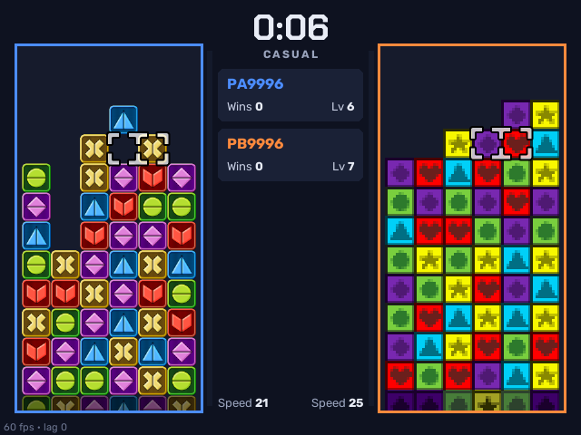
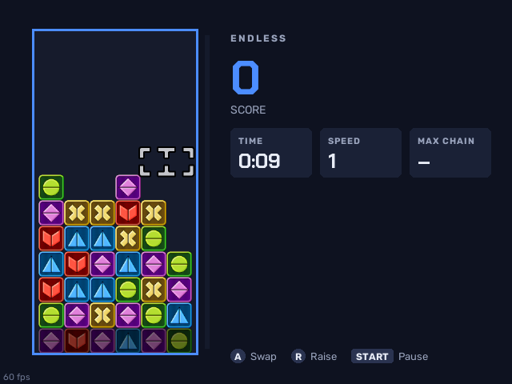
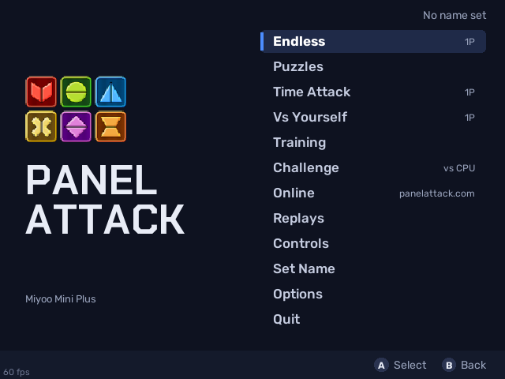
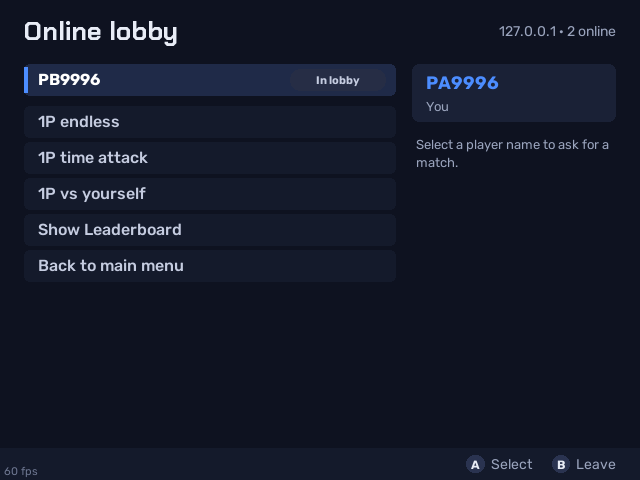

# Panel Attack for Miyoo Mini Plus

**[Panel Attack](https://github.com/panel-attack/panel-game) (the free Tetris Attack / Puzzle League clone) running on the Miyoo Mini Plus under OnionOS, with online play against PC players on the official server.**

> **Unofficial.** This is a modified version of Panel Attack for one handheld, not affiliated with the Panel Attack team. Please report problems with this port here, not to them. The full list of changes ships in the game folder as `MODIFIED.txt`.

> 🤖 **Built by Claude.** This port was designed and written by [Claude](https://claude.ai), Anthropic's AI model, at the request of [@snyderman3000](https://github.com/snyderman3000). He came up with the idea, chose the direction and tested every build on real hardware. Claude wrote the code, the renderer, the handheld UI and the documentation. Please report bugs through [Issues](https://github.com/snyderman3000/panelattack-miyoo/issues).

| | |
|---|---|
|  |  |
|  |  |

Screenshots show Panel Attack art (panels by April93, public domain; characters by Gaster and JamBox, CC BY-SA 4.0). Full credits: [COPYING-ASSETS](https://github.com/panel-attack/panel-game/blob/main/COPYING-ASSETS).

## Features

- **Online versus** on panelattack.com over Wi-Fi: lobby, challenges, ranked and casual matches, rollback when the connection hiccups. Plays against PC and other handheld players.
- **Endless, Time Attack, Vs Yourself, Puzzles, Training and Challenge** modes.
- **60 fps** on the Mini Plus thanks to a custom 2D renderer (no GPU needed).
- **A UI made for the 640×480 screen**: both boards side by side with a centre info column, bigger text, a menu built for a D-pad, and an on-screen keyboard for your name.
- **Mixtape support**: install and update it from [Mixtape](https://github.com/snyderman3000/mixtape) over Wi-Fi.

- **Sound and music**, through OnionOS's audio service.

Not supported: local 2-player.

## Install

**With Mixtape:** open Mixtape, find **Panel Attack** and press A. Press Y in Mixtape later to check for updates.

**By hand:**

1. Download `PanelAttack-miyoo-vX.Y.Z.zip` from [Releases](https://github.com/snyderman3000/panelattack-miyoo/releases).
2. Extract it and copy the `Roms` folder to the root of your SD card, merging it with the `Roms` folder already there. Coming from a version before 0.9.0 (which lived in Apps)? The first launch moves your settings over and removes the old Apps entry.
3. Open **Games → Ports → Panel Attack**. (The Ports list needs OnionOS's "Ports" system from Package Manager → Verified.) For online play, turn Wi-Fi on and set a name first.

Requires OnionOS on a Miyoo Mini Plus. Online play needs the Plus (or another Wi-Fi model).

## Controls

| Button | In a match | In menus |
|---|---|---|
| D-pad | Move cursor | Move |
| A / B | Swap panels | Select / back |
| L1, L2, R1, R2 | Raise the stack | Page (character select) |
| X / Y | Taunt | X: change case (keyboard) |
| START | Pause | Ready / confirm |
| SELECT | | Back |
| SELECT + START | Quit | Quit |

## How it works

The Mini Plus has a 1.2 GHz dual-core ARM CPU and no GPU, so the stock LÖVE/OpenGL path ran at about 11 fps. This port keeps Panel Attack's game code untouched where possible and swaps out what's underneath:

| Path | Purpose |
|---|---|
| `mini2d/mini2d.c` | Software 2D renderer: premultiplied-alpha blits with per-row opaque/transparent span tables, scale cache, double-buffered present on a separate thread using the SoC's 2D blitter (MI_GFX) to scale, rotate 180° and flip to the screen |
| `overlay/miyoo/graphics.lua` | `love.graphics` replacement on top of mini2d (images, canvases, fonts, sprite batches, scissor) |
| `overlay/miyoo/shim.lua` | Window and input (Miyoo buttons → Panel Attack keys); turns on LÖVE's OpenAL audio, or silent stubs when no sound device opens |
| `tools/convert_audio.py`, `tools/make_sfx.py`, `sounds/` | Audio prepared for the handheld: re-encoded to mono, trimmed variants, and new CC0 sound effects replacing ones we may not redistribute |
| `overlay/miyoo/hud.lua` | In-match layout for 640×480 |
| `overlay/miyoo/menus.lua`, `lobby.lua`, `charselect.lua`, `ui.lua` | Handheld menus, lobby and character select |
| `overlay/miyoo/osk.lua` | On-screen keyboard |
| `overlay/miyoo/patches.lua` | Runtime tweaks (frame pacing, asset choice, controller setup) |
| `patches.py` | Small source edits applied to Panel Attack at build time; the build fails if one no longer applies |
| `build_game.sh`, `build_pkg.sh` | Build the game folder and the release zip |
| `tools/` | Desktop test harness: run the game headless with scripted input and frame dumps, or two clients against a local server |

Panel Attack itself is pinned in `upstream/` (a git submodule). See [docs/BUILDING.md](docs/BUILDING.md).

## Credits

- **Panel Attack** by Robert Burke and the Panel Attack contributors (zlib; assets under their own licenses, see `COPYING-ASSETS`).
- **LÖVE** 11.5 (zlib), **LuaJIT** (MIT).
- **steward-fu**'s Miyoo Mini toolchain and SDL2 port.
- **Fonts:** Rubik and Chakra Petch (SIL Open Font License).
- **OS:** [OnionOS](https://github.com/OnionUI/Onion).
- **Port code, renderer, UI and docs:** written by Claude (Anthropic).

## License

The port code in this repository is MIT licensed, see [LICENSE](LICENSE). The release zip bundles Panel Attack, LÖVE and libraries under their own licenses, listed in [THIRD_PARTY_NOTICES.md](THIRD_PARTY_NOTICES.md).
